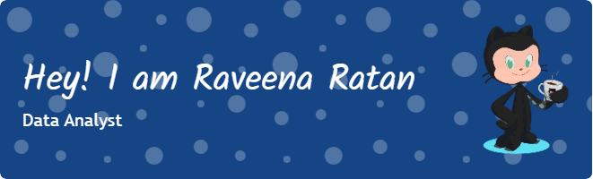

<h1 align="center">Hi 👋, I'm Raveena Ratan</h1>
<h3 align="center">A passionate Data Analyst from India</h3>

  

- 🌱 I’m currently learning **Data Science**

- 📝 I regularly write articles on [https://medium.com/@raveenaratan](https://medium.com/@raveenaratan)

- 📫 How to reach me **raveenaratan96@gmail.com**

<!-- ### Blogs posts -->
<!-- BLOG-POST-LIST:START -->
<!-- BLOG-POST-LIST:END -->

<h3 align="left">Connect with me:</h3>

<h3 align="left">Languages and Tools:</h3>

            

<!-- 

&nbsp;

 -->

